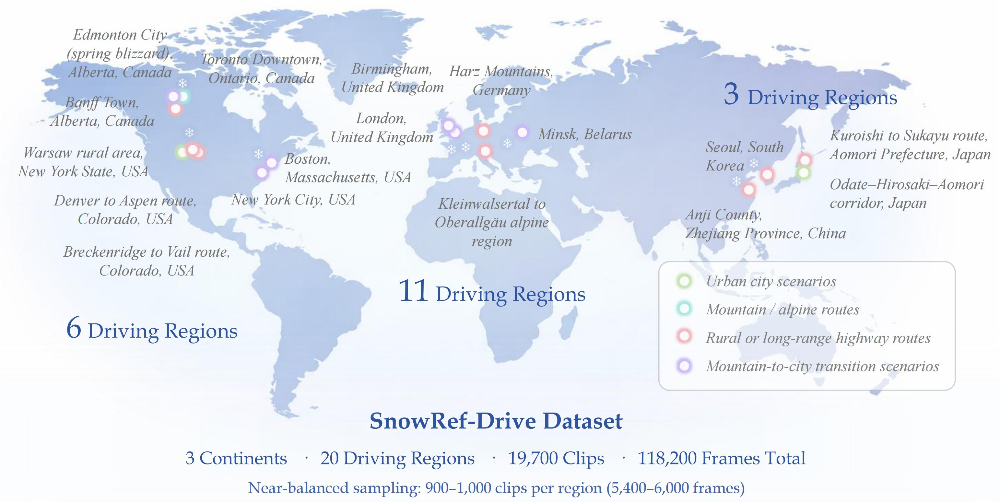

# ☃️❄️ SnowRef-Drive ❄️✨
✨ **A Global Instruction-Driven Traffic Video Segmentation Dataset for Adverse Winter Driving**

  

  ❄️ Winter Driving &nbsp;|&nbsp; 🚗 Traffic Video Segmentation &nbsp;|&nbsp; 📝 Instruction-Driven Perception  

---

## 🌟 Highlights

- ❄️ **First Large-Scale Snow-Oriented Segmentation Dataset**  
- 🌍 **Global Coverage Across 3 Continents & 20 Regions**  
- 🎯 **Instruction-Driven Video Segmentation Benchmark**  
- 🧊 **Adverse Weather Focus**: Heavy snow · Night snowfall · Fog · Low visibility  
- 🧩 **Pixel-Level Temporal Annotations** with Identity Consistency  

---

  

> ✨ **SnowRef-Drive** is a large-scale instruction-driven traffic video segmentation dataset specifically designed for **adverse winter driving scenarios**.  
> ❄️ It provides **118,200 pixel-level annotated frames** with compositional referring instructions to benchmark segmentation robustness under snow degradation.

📄 <b>Paper:</b> Under Review &nbsp;&nbsp;&nbsp; 📦 <b>Dataset & Code:</b> Will be released prior to submission in compliance

---

## 🌨️📊 Dataset Overview

  

SnowRef-Drive is constructed as a **short-clip instruction-driven video segmentation benchmark**.

Each sample contains:

- 🎥 **6 RGB frames** (3s @ 2 FPS)  
- 📝 **1 natural language referring instruction**  
- 🎯 **6 pixel-level instance masks**  

### 📈 Scale

- ❄️ **19,700 video clips**  
- 🧊 **118,200 annotated frames**  
- 🌍 **20 winter driving regions**  
- 🌎 **3 continents** (North America · Europe · East Asia)

---

## 🌍❄️ Global Winter Coverage

  

### 🗺️ Representative Regions

**North America**

- 🇨🇦 Toronto · Edmonton · Banff  
- 🇺🇸 New York · Boston · Denver–Aspen · Colorado Alpine Routes  

**Europe**

- 🇬🇧 London · Birmingham  
- 🇩🇪 Harz Mountains · Alps (DE–AT Border)  
- 🇧🇾 Minsk  

**East Asia**

- 🇯🇵 Aomori · Akita–Aomori Corridor  
- 🇰🇷 Seoul  
- 🇨🇳 Anji  

---

## 🌨️✨ Adverse Weather Focus

SnowRef-Drive explicitly targets **real-world winter degradation**:

- ❄️ Heavy snowfall  
- 🌙 Nighttime snow driving  
- 🌫 Fog & haze  
- 🧊 Low illumination  
- 🌨 Mixed rain–snow  

These conditions introduce:

- motion blur  
- occlusion  
- low contrast  
- reflective road surfaces  

making SnowRef-Drive a **stress-test benchmark for robust perception**.

---

## 📝✨ Instruction Design

SnowRef-Drive adopts **compositional referring expressions**, combining:

- 🎨 Appearance attributes  
- 📍 Spatial constraints  
- 🔗 Object relations  
- ⏱ Temporal scope  
- 🚗 Motion or static state  

### Example

> ✨ *"Segment the black SUV driving ahead in the center lane on the snowy highway throughout all frames."*

This design enforces:

- ✅ instance-level reasoning  
- ✅ identity consistency  
- ✅ cross-frame grounding  

---

## 🧊⏱️ Temporal Structure

Each clip follows a **standardized short-clip protocol**:

- ⏳ Duration: **3 seconds**  
- 🎞 Sampling: **2 FPS**  
- 🖼 Frames: **6 per clip**  
- 🔁 Identity preserved across frames  

This balances:

- temporal context  
- annotation reliability  
- large-scale usability  

---

## 🚀✨ Benchmark Usage

SnowRef-Drive supports evaluation of:

- 🎯 Instruction grounding  
- 🧠 Vision-language alignment  
- 🧩 Pixel-level segmentation  
- 🔁 Temporal identity consistency  
- ❄️ Robustness under snow degradation  

It is especially suitable for:

- Zero-shot perception  
- Training-free inference  
- Multimodal foundation model evaluation  

---

## 📦❄️ Dataset & Code Release Plan

⚠️ **Important Notice**

This repository currently serves as the **official project homepage for peer review**.

- 📦 Dataset: **Will be released prior to submission** in compliance with journal data policies  
- 💻 Code: **Will be released prior to submission**, including dataset loaders and evaluation scripts  
- 🧊 Download mirrors, checksums, and documentation will be provided together  

We strictly follow journal data and code release requirements.

---

## 📜 License

SnowRef-Drive will be released under:

> **Creative Commons Attribution 4.0 International (CC BY 4.0)**

